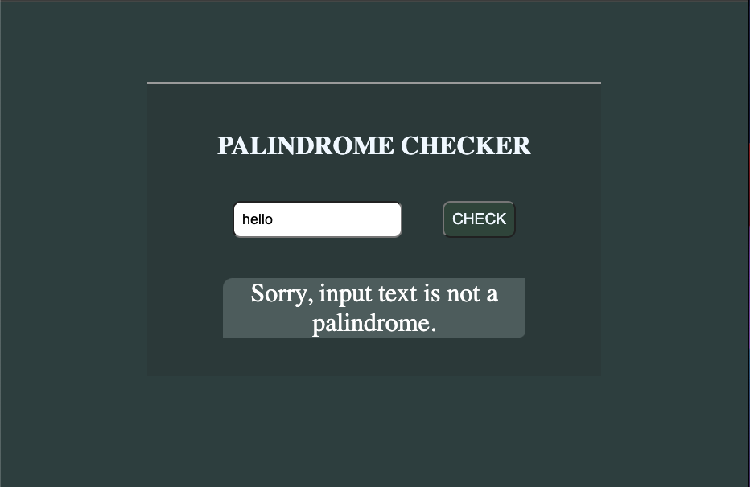

# Palindrome Checker

## Project Description
> What is a Palindrome? A palindrome is a word, number, phrase, or other sequence of symbols that reads the same backwards as forwards, such as madam or racecar etc... so our app main funtion is compute a any input text and tell if it is a palindrome or not.

## App Home page

> This is the bueatiful front view of our app

## Is Not a Palindrome

> A word, number, phrase or sequence of symbols that does not fulfill the condition is displayed the massage is NOT a palindrome

## Is a Palindrome

> A word, number, phrase or sequence of symbols that does not fulfill the condition is displayed the massage is a palindrome

## About this App
 This is an app built to check if a string, number or a any input text and tell if it is a palindrome of not.

## Built with
- HTML
- CSS
- JS

### Prerequisites
  Knowledge about JS function CSS styles & HTML tags
- if statments
- For loop
- Flex
- Grid

## You Wanna Try Out the App
Click [here](https://buhills.github.io/palindrome-checker/)

## Author
. GitHub: [@buhills](https://github.com/buhills)
. Twitter: [@hills_nfor](https://twitter.com/hills_nfor)
. Linkedln: [@hills_nfor](https://linkedln.com/hills_nfor)